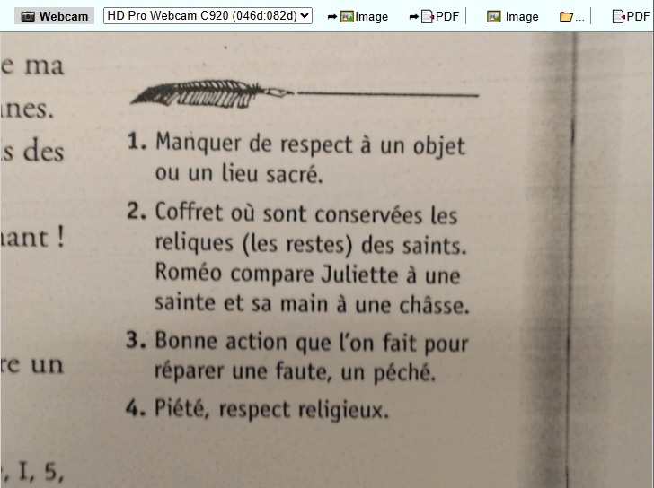
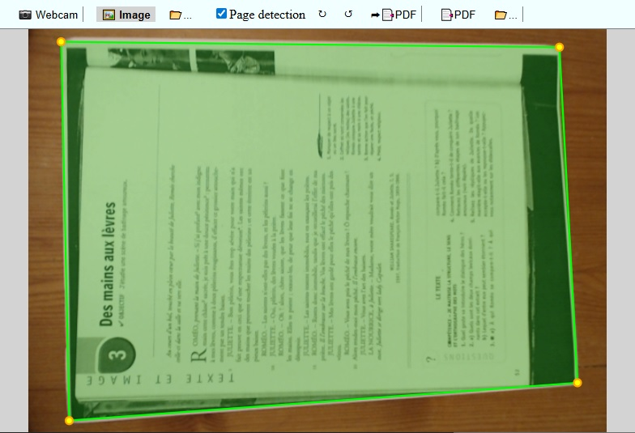
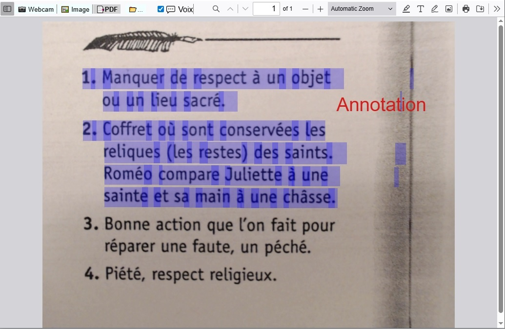

# 📘 Application pour la lecture vocale de document PDF et creation de PDF textuel à partir d'image

## 📄 Présentation

Cette application est conçue pour aider les personnes atteintes de troubles "dys" (dyslexie, dyspraxie, etc.) à travailler sur des documents papier à l'aide d'un ordinateur. Elle permet :

- 🔊 De lire à voix haute le texte sélectionné dans un PDF.
- 📝 D'ajouter du texte sur un PDF et de l'imprimer.
- 🖼️ De transformer une image en PDF avec une couche de texte sélectionnable par reconaissance de charactères.
- ✂️ De détecter automatiquement le contour d'une feuille sur une image pour redresser le texte ou de redresser manuellement.
- 📷 De capturer une image depuis une webcam ou d'importer une image depuis un fichier.

---

## Mode webcam:

## Mode image / redressement:

## Mode PDF / Lecture vocale:

---

# 📘 PDF Document Voice Reader & PDF text creation from image

## 📄 Overview

This application supports individuals with "dys" disorders (e.g., dyslexia, dyspraxia) in working with physical text documents using a computer. It provides the following features:

- 🔊 Reads aloud selected text from PDFs using Text-to-Speech (TTS).
- 📝 Adding Text and Printing PDF
- 🖼️ Generates a PDF from an image with selectable text layer via character recognition (OCR).
- ✂️ Automatically detects document boundaries in images for perspective correction and edit contours manually.
- 📷 Captures images using a webcam or loads images from files.

---

## ⚙️ Technologies Used

- 🧠 The application is developed in **JavaScript** and uses **Electron** to deliver a native desktop experience.
- 🔍 **Tesseract v6.0.1** for Optical Character Recognition (OCR)
  [GitHub - Tesseract OCR](https://github.com/tesseract-ocr/tesseract)
- 🗣️ **piper-tts-web (7c4b54d)** for Text-to-Speech (TTS)
  [GitHub - Piper TTS Web](https://github.com/Mintplex-Labs/piper-tts-web)
- 📄 **pdf.js v5.3.93** by Mozilla for PDF rendering and editing
  [GitHub - Mozilla PDF.js](https://github.com/mozilla/pdf.js)
- 🖼️ **openCV.js v4.0** for image processing and contour detection
  [docs.opencv.org](https://docs.opencv.org/4.x/d0/d84/tutorial_js_usage.html)