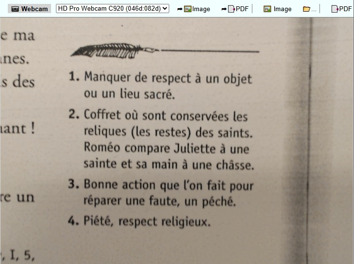
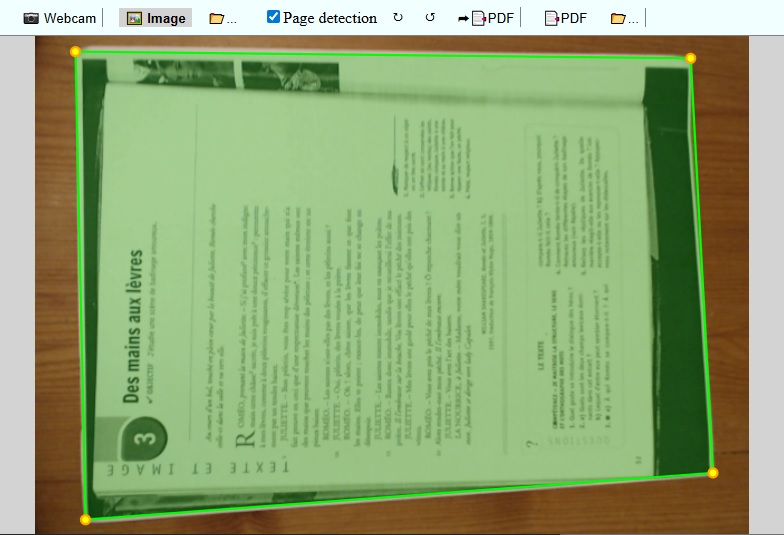
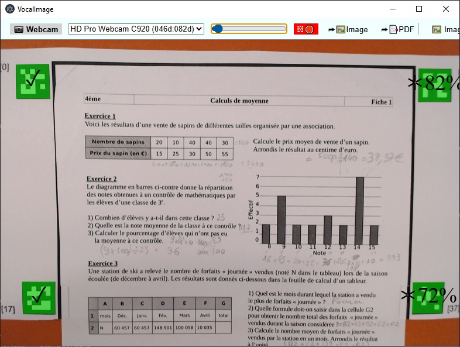
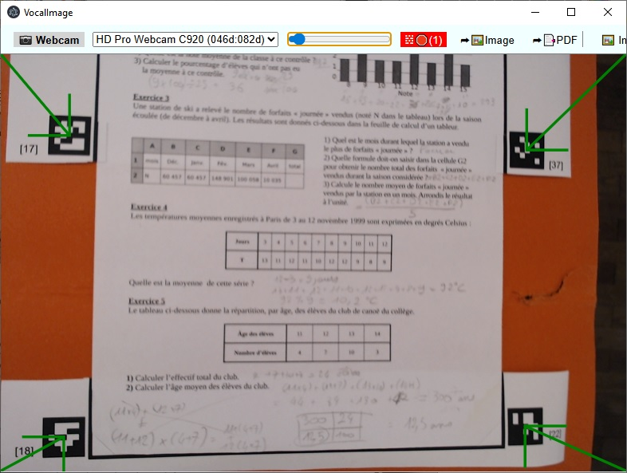
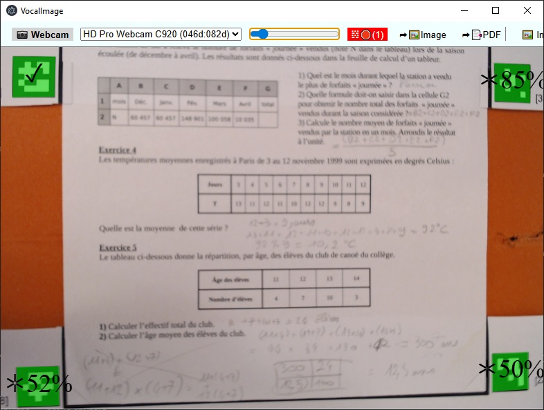

# 📘 Application déconnectée pour la lecture vocale de document PDF et création de PDF textuel à partir d'image

## 📄 Présentation

Cette application est conçue pour aider les personnes atteintes de troubles "dys" (dyslexie, dyspraxie, etc.) à travailler sur des documents papier à l'aide d'un ordinateur, sans internet. Elle permet :

- 🔊 De lire à voix haute le texte sélectionné dans un PDF.
- 📝 D'ajouter du texte sur un PDF et de l'imprimer.
- 🖼️ De transformer une image en PDF avec une couche de texte sélectionnable par reconnaissance de caractères.
- ✂️ De détecter automatiquement le contour d'une feuille sur une image pour redresser automatiquement le texte ou le redresser manuellement.
- ⌧ D'utiliser des marqueurs (cf. masque de page [Aruco](doc/aruco.pdf) à découper) pour redresser et recoller rapidement deux captures d’une même page A4
- 📷 De capturer une image depuis une webcam ou d'importer une image depuis un fichier.
- 🇫🇷 De choisir la langue de reconnaissance de texte et la voix parmi: français, anglais, allemand, italien et espagnol.
- 🌐 Tout est calculé dans l'application **sans connexion internet**

---

## Mode webcam:

## Mode image / redressement:

## Mode PDF / Lecture vocale:

## Mode Redressement/Recollage automatique:
| Mise en place de la feuille | Vérificaction du cadrage | Vérificaction de la netteté |
| --- | --- | --- |
|  |  |  |

| Passage à la page 2 automatique | Cadrage de la page 2 | Vérificaction de la netteté de la page 2 avant capture finale |
| --- | --- | --- |
|  |  |  |

---

# 📘 PDF Document Voice Reader & PDF text creation from image

## 📄 Overview

This offline application supports individuals with "dys" disorders (e.g., dyslexia, dyspraxia) in working with physical text documents using a computer. It provides the following features:

- 🔊 Reads aloud selected text from PDFs using Text-to-Speech (TTS).
- 📝 Adding Text and Printing PDF
- 🖼️ Generates a PDF from an image with selectable text layer via character recognition (OCR).
- ✂️ Automatically detects document boundaries in images for perspective correction and edit contours manually.
- ⌧ [Aruco](doc/aruco.pdf) marker detection to unskew and stitch two capture from a single A4 sheet.
- 📷 Captures images using a webcam or loads images from files.
- 🇬🇧 UI, OCR, and Voice are available in the following languages: French, English, German, Italian, and Spanish.
- 🌐 Fully Offline

---

## ⚙️ Technologies Used

- 🧠 The application is developed in **JavaScript** and uses **Electron** to deliver a native desktop experience.
- 🔍 **Tesseract v6.0.1** for Optical Character Recognition (OCR)
  [GitHub - Tesseract.js OCR](https://github.com/naptha/tesseract.js/tree/v6.0.1)
- 🗣️ **piper-tts-web (7c4b54d)** for Text-to-Speech (TTS)
  [GitHub - Piper TTS Web](https://github.com/Mintplex-Labs/piper-tts-web/tree/7c4b54d)
- 📄 **pdf.js v5.3.93** by Mozilla for PDF rendering and editing
  [GitHub - Mozilla PDF.js](https://github.com/mozilla/pdf.js/tree/v5.3.93)
- 🖼️ **openCV.js v4.0** for image processing and contour detection
  [docs.opencv.org](https://docs.opencv.org/4.x/d0/d84/tutorial_js_usage.html)

---

### 🇩🇪 Deutsch (automatisch generiert)

---

# 📘 PDF-Dokumenten-Sprachleser & PDF-Text-Erstellung aus Bildern

## 📄 Übersicht

Diese Offline-Anwendung unterstützt Personen mit „Dys“-Störungen (z. B. Dyslexie, Dyspraxie) bei der Arbeit mit physischen Textdokumenten am Computer. Sie bietet folgende Funktionen:

- 🔊 Liest ausgewählten Text aus PDFs mit Text-to-Speech (TTS) vor.
- 📝 Text hinzufügen und PDF drucken
- 🖼️ Generiert ein PDF aus einem Bild mit auswählbarer Textebene mittels optischer Zeichenerkennung (OCR).
- ✂️ Erkennt automatisch Dokumentgrenzen in Bildern zur Perspektivkorrektur und ermöglicht manuelle Konturbearbeitung.
- ⌧ Erkennt Aruco-Marker zum Entzerren und Zusammenfügen von zwei Aufnahmen einer A4-Seite.
- 📷 Erfasst Bilder mit einer Webcam oder lädt Bilder aus Dateien.
- 🇩🇪 Benutzeroberfläche (UI), OCR und Sprache sind in den folgenden Sprachen verfügbar: Französisch, Englisch, Deutsch, Italienisch und Spanisch.
- 🌐 Vollständig offline

*Dieser Text wurde automatisch generiert.*

---

### 🇮🇹 Italiano (testo generato automaticamente)

---

# 📘 Lettore vocale PDF & Creazione di testo PDF da immagine

## 📄 Panoramica

Questa applicazione offline supporta persone con disturbi “dys” (ad es. dislessia, disprassia) nella gestione di documenti di testo cartacei con il computer. Offre le seguenti funzionalità:

- 🔊 Legge ad alta voce il testo selezionato dai PDF con Text-to-Speech (TTS).
- 📝 Aggiungi testo e stampa PDF
- 🖼️ Genera un PDF da un’immagine con livello di testo selezionabile tramite riconoscimento ottico dei caratteri (OCR).
- ✂️ Rileva automaticamente i confini del documento nelle immagini per la correzione prospettica e consente la modifica manuale dei contorni.
- ⌧ Rileva i marker Aruco per correggere la distorsione e unire due acquisizioni di un foglio A4.
- 📷 Acquisisce immagini tramite webcam o carica file di immagini.
- 🇮🇹 Interfaccia utente (UI), OCR e voce disponibili nelle seguenti lingue: francese, inglese, tedesco, italiano e spagnolo.
- 🌐 Completamente offline

*Questo testo è stato generato automaticamente.*

---

### 🇪🇸 Español (texto generado automáticamente)

---

# 📘 Lector de voz de PDF y creación de texto PDF desde imagen

## 📄 Descripción general

Esta aplicación offline ayuda a personas con trastornos “dys” (p. ej., dislexia, dispraxia) a trabajar con documentos de texto físicos con la ayuda de un ordenador. Ofrece las siguientes funciones:

- 🔊 Lee en voz alta el texto seleccionado de archivos PDF con Text-to-Speech (TTS).
- 📝 Agrega texto e imprime PDF
- 🖼️ Genera un PDF desde una imagen con capa de texto seleccionable mediante reconocimiento óptico de caracteres (OCR).
- ✂️ Detecta automáticamente los límites del documento en las imágenes para corregir la perspectiva y permite editar manualmente los contornos.
- ⌧ Detecta marcadores Aruco para corregir la distorsión y unir dos capturas de una sola hoja A4.
- 📷 Captura imágenes con una cámara web o carga archivos de imagen.
- 🇪🇸 Interfaz de usuario (UI), OCR y voz disponibles en los siguientes idiomas: francés, inglés, alemán, italiano y español.
- 🌐 Totalmente offline

*Este texto ha sido generado automáticamente.*
