## Captura de libro

1. Imprime dos veces la hoja de detección de página de libro al final de este documento y recorta una muesca en la parte inferior o superior, como se indica 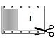 y 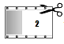.
2. Coloca la hoja detrás de la página:
   - corte 1: en la parte superior de la página izquierda o inferior de la derecha
   - corte 2: en la parte inferior de la izquierda o superior de la derecha
   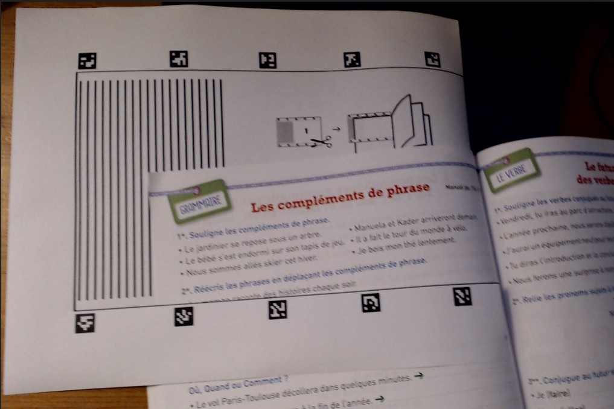
3. Asegúrate de que el modo Webcam esté activado (primer botón « 📷 Webcam » en la barra de herramientas).
4. Selecciona la cámara externa en el menú desplegable.
5. Activa el modo de detección de marcadores con el botón « 𝍌▶️ ».
   - El botón cambia de color e indica la etapa « 𝍌🛑 (1/2) » según el número de partes seleccionadas (2 por defecto).
6. Para cancelar la captura, pulsa en cualquier momento el botón de parada « 𝍌🛑 (1/2) ».
7. Enmarca los marcadores ArUco para resaltar la zona a capturar: 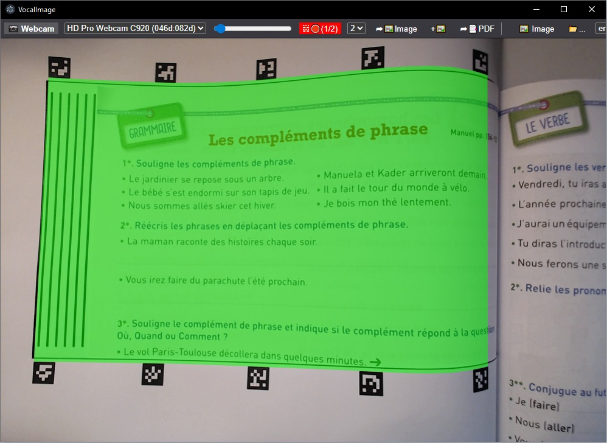
8. Cuando la zona sea suficientemente grande y la imagen esté nítida, pulsa la barra espaciadora o el botón « ➦🖼️ Image » para capturar la imagen: 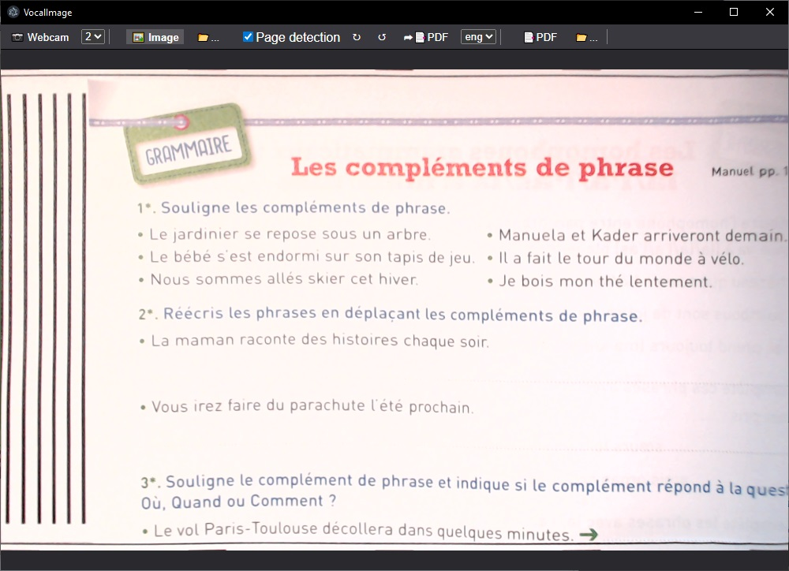

## Captura de hoja A4 en dos pasos

1. Imprime la hoja de marcadores 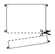 al final de este documento, recorta la parte inferior y haz cortes en las esquinas con un cúter para guiar las hojas.
2. Desliza la hoja a escanear en las 4 esquinas y las dos muescas laterales para alinearla con los marcadores.
   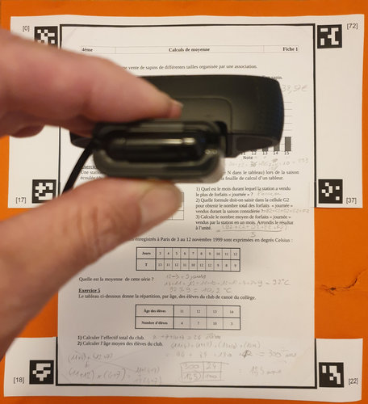
   Nota: las dos partes pueden pegarse en una carpeta para facilitar la colocación y el almacenamiento.
3. Asegúrate de que el modo Webcam esté activado (primer botón « 📷 Webcam »).
4. Selecciona la cámara externa.
5. Activa el modo de detección de marcadores con el botón « 𝍌▶️ ».
   - El botón cambia de color e indica « 𝍌🛑 (1/2) » según el número de partes seleccionadas.
6. Para cancelar, pulsa el botón « 𝍌🛑 (1/2) ».
7. Sigue las instrucciones en pantalla para cubrir el máximo área posible.
   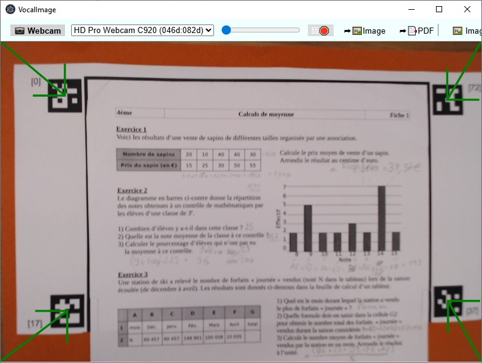
8. Mantén el encuadre unos segundos para pasar a la siguiente parte.
   **Nota:** pulsa la barra espaciadora para usar la captura actual sin optimizar.
9. Ahora los marcadores inferiores deben estar arriba para continuar.
   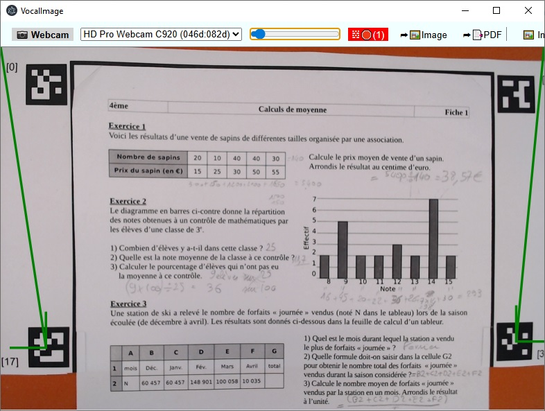
10. Repite los pasos 7 a 9 para capturar las siguientes partes.
11. Al finalizar, se activa el modo « 🖼️ Image » y puedes ajustar la costura de la imagen.
    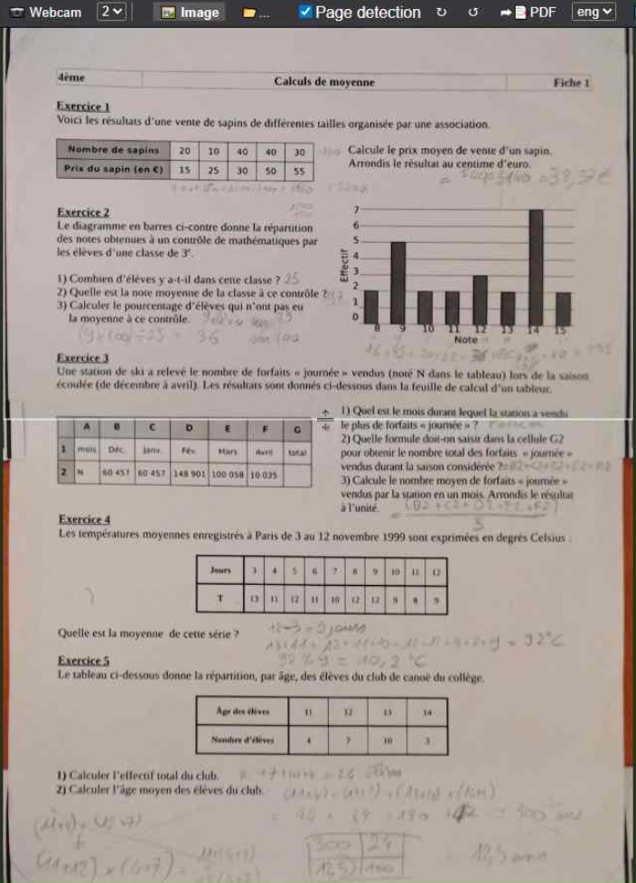
12. Validación de la costura:
    - automáticamente con « ➦📑 PDF »
    - con el icono « ✓ »
    - guardando con « ⬇️ »
    - clic derecho en la barra de costura

## Modo PDF y lectura en voz alta

El texto seleccionado se lee automáticamente en el idioma elegido cuando el modo PDF está activo:
- al convertir una imagen con « ➦📑 PDF »
- o al abrir un archivo PDF con « 📂… »
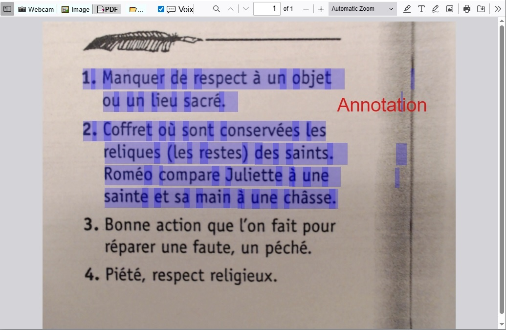

**Notas:**
1. No se lee si « 💬 Voix » no está activado.
2. Se usa el idioma detrás del icono « 💬 Voix ». Se recomienda usar el mismo idioma para PDF y lectura.
